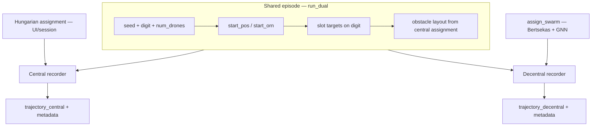
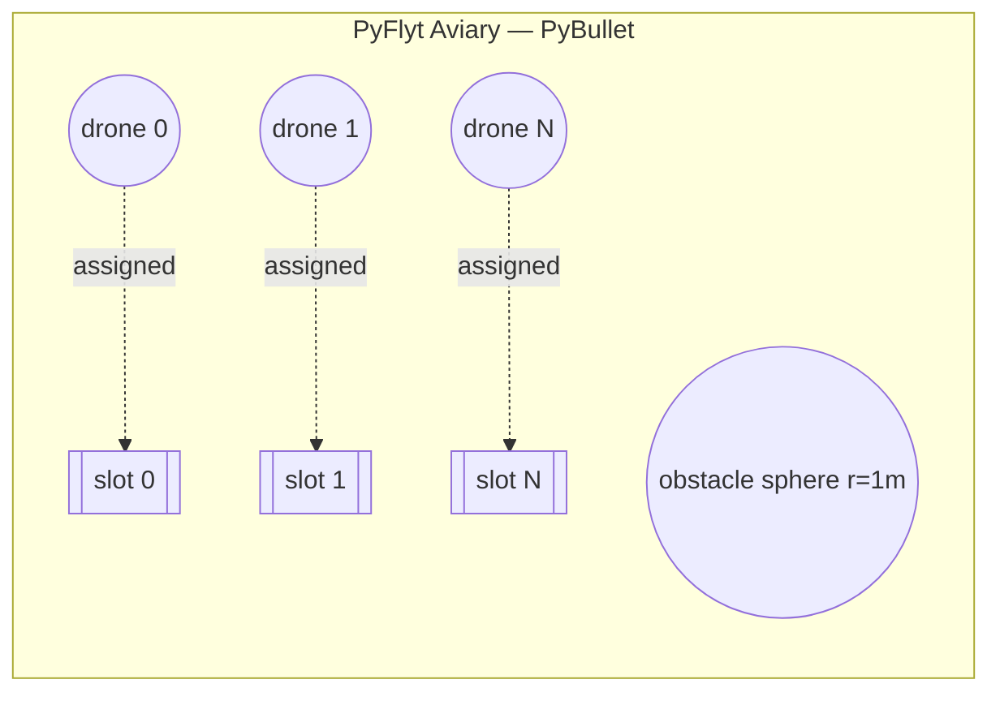
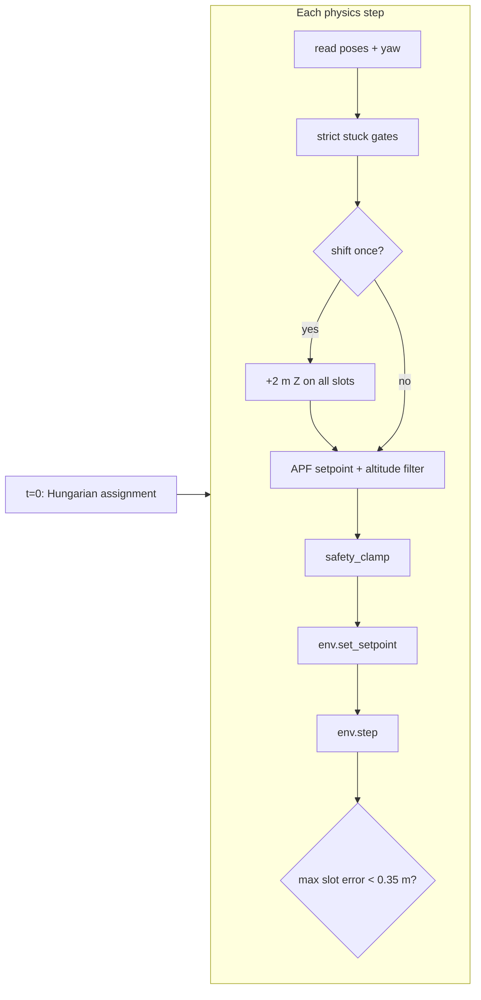
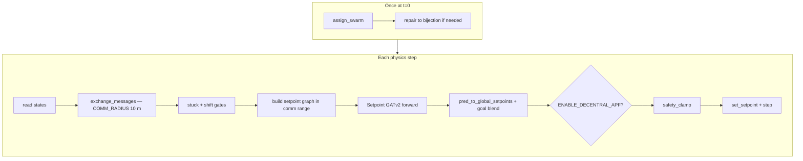
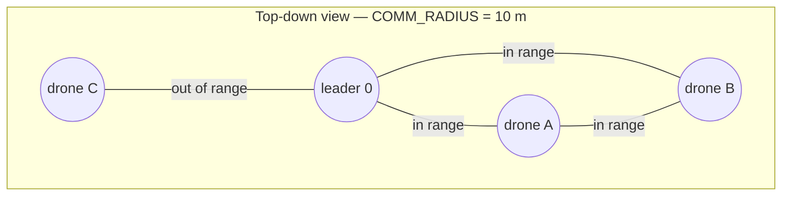
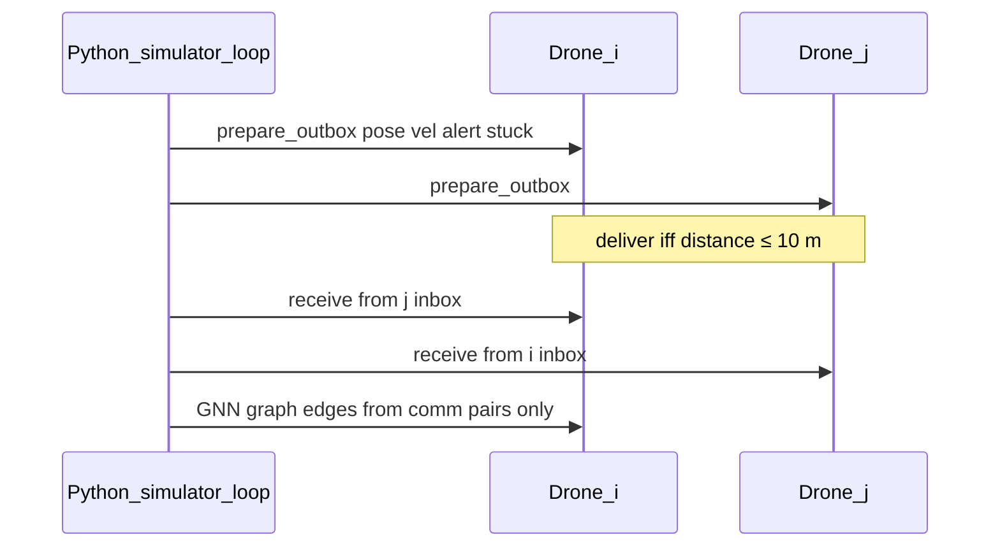
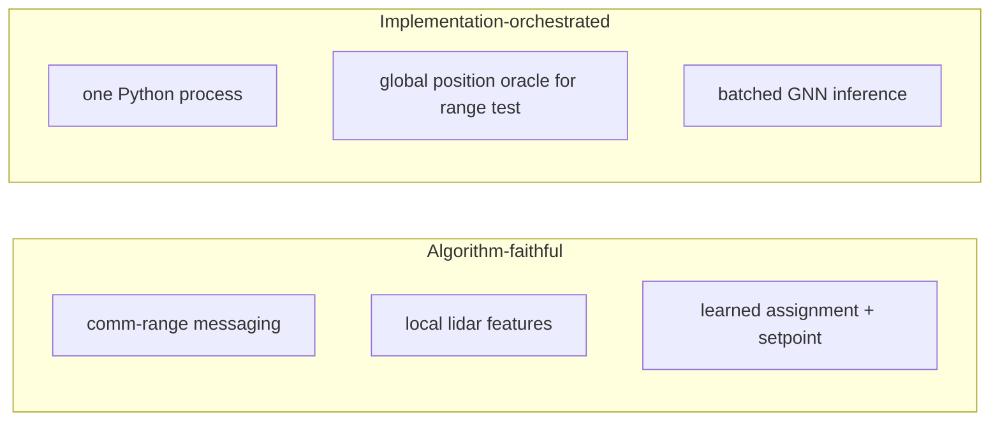
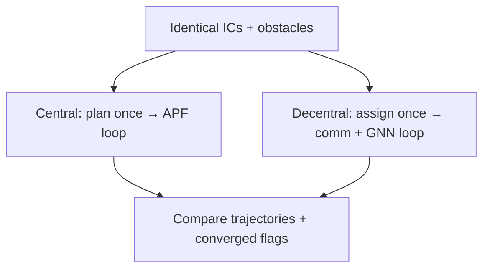
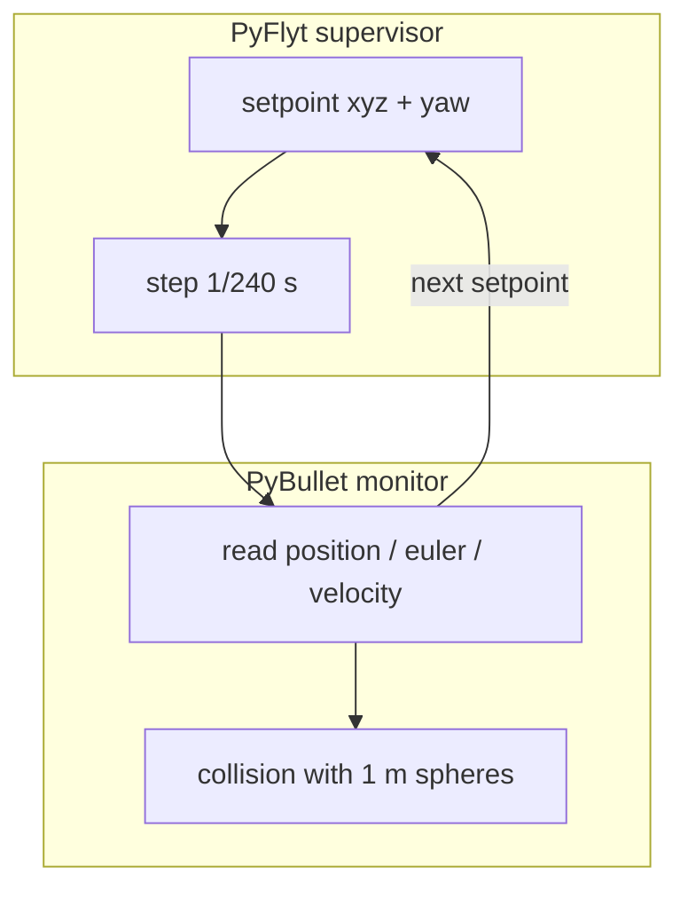
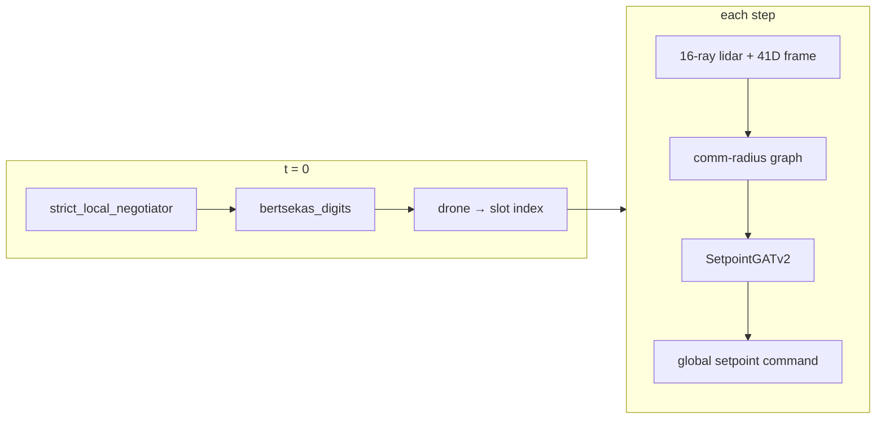

# Backend Dual Simulation — Presentation (Central vs Decentral)

**Scope:** headless physics + control only (`Website/Theoritical/backend`).  
**Goal:** same spawn, digit formation, obstacles — two policies compared fairly.

---

## Slide 1 — One episode, two controllers

| Output field | Meaning |
|--------------|---------|
| `steps` | Physics steps until stop |
| `converged` | All drones within **0.35 m** of **assigned** slot for **25** steps |
| `stopped_reason` | `converged` or `max_steps` |
| `assignment_*` | Who flies to which slot ring |

**Entry:** [`dual_simulator.py`](backend/dual_simulator.py) → `record_central` + `record_episode_frames_decentral`.

---

## Slide 2 — Swarm geometry (what is identical)

- **240 Hz** integration (`PHYSICS_HZ = 240`), position-mode setpoints (`env.set_mode(7)`).
- Slots = digit formation targets; **assignment** maps drone → slot index.
- Obstacles: **1.0 m** radius spheres from `build_obstacles_for_episode` (same `obs_cfg` for both runs).

---

## Slide 3 — Central pipeline (classical, no GNN)

| Property | Central |
|----------|---------|
| Assignment | Global optimum at start (`scipy.linear_sum_assignment`) |
| Control | Fixed slot targets + viz APF repulsion |
| Messages | None — implicit global plan |
| Shift | Strict stuck → one-time **+2 m Z** on formation |

**Code:** [`sim_recorder_central.py`](backend/sim_recorder_central.py)

---

## Slide 4 — Decentral pipeline (learned swarm)

| Property | Decentral |
|----------|-----------|
| Assignment | Bertsekas + **local negotiator** GNN (not Hungarian) |
| Control | **GNN** each step + pull toward assigned slot (`SETPOINT_GOAL_GAIN`) |
| Sensing | **16-ray planar lidar** + graph features (training parity) |
| Messages | `StateMsg` + `ShiftProposal` within **10 m** |
| Optional | Runtime APF layer (`ENABLE_DECENTRAL_APF = True`) |

**Code:** [`sim_recorder_decentral.py`](backend/sim_recorder_decentral.py), [`comm_orchestrator.py`](backend/agents/comm_orchestrator.py), [`website_gnn/`](backend/website_gnn/)

---

## Slide 5 — How drones “talk” (comm radius)

**Inbox contents:** neighbor state + optional shift proposal when sender is locally stuck.

---

## Slide 6 — Faithfulness (what is honest vs orchestrated)

| Aspect | Faithful to decentral design | Orchestrated in this backend |
|--------|------------------------------|------------------------------|
| Who hears whom | Only pairs ≤ **COMM_RADIUS** | Simulator knows all positions to test range |
| GNN graph | Edges only between comm neighbors | One batched forward over full swarm |
| Slot visibility | `SLOT_VISIBILITY_RADIUS` (10 m) in training design | `assign_swarm` returns a global map at t=0 |
| Physics | Per-drone PyFlyt setpoints | **Single** shared PyBullet world |
| Alerts | `planar_lidar` on active drones | Same formula as training frame builder |

**Presenter line:**  
*“We run decentralized **algorithms** inside a centralized **simulator** — correct for theory and A/B tests, not a deployed radio network.”*

---

## Slide 7 — Central vs Decentral (comparison slide)

| | **Central** | **Decentral** |
|---|-------------|----------------|
| **Assignment @ t=0** | Hungarian (optimal sum of distances) | Bertsekas + negotiator GNN |
| **Every step** | Slot + APF + clamp | Messages → GNN → hybrid goal + optional APF |
| **Uses checkpoints** | No | Yes (4 files under `resources/checkpoints/`) |
| **Comm** | — | 10 m radius |
| **Convergence** | `max_assigned_slot_error` < **0.35 m** × **25** steps | Same metric |
| **Step cap** | `MAX_STEPS_CONVERGED` = **6000** when `RUN_UNTIL_CONVERGED` | Same |

**Fairness note:** Decentral reuses **central** `obs_cfg` so obstacle layout does not favor either controller.

---

## Slide 8 — Control stack under the hood

| Knob (`viz_sim_config.py`) | Typical role |
|----------------------------|--------------|
| `SETPOINT_PRED_GAIN` / `SETPOINT_GOAL_GAIN` | GNN vs slot pull (0.65 / 0.35) |
| `CENTRAL_APF_*` / `DECENTRAL_APF_*` | Obstacle repulsion strength |
| `SLOT_SHIFT_DELTA_Z` | +2 m escape when stuck |
| `RECORD_EVERY` | Log every 2 physics steps |

---

## Slide 9 — Models (decentral only)

Checkpoints: `resources/checkpoints/` (required before `run_dual`).

Training alignment: feature builders and APF teacher live in `merged_work/models_creation/`.

---

## Slide 10 — Key files (backend only)

| Topic | Path |
|-------|------|
| Dual run | `backend/dual_simulator.py` |
| Central episode | `backend/sim_recorder_central.py` |
| Decentral episode | `backend/sim_recorder_decentral.py` |
| Comm + agents | `backend/agents/comm_orchestrator.py`, `drone_agent.py` |
| GNN inference | `backend/website_gnn/assignment_runner.py`, `setpoint_runner.py` |
| APF / shift / clamp | `backend/slot_shift_safety.py` |
| Convergence helper | `backend/sim_frame_utils.py` |
| Viz knobs | `backend/viz_sim_config.py` |

---

## Presenter cheat sheet (30 s each)

1. **Dual sim** — one seed, two trajectories; only assignment + control differ.  
2. **Central** — Hungarian then classical APF to slots; no learning.  
3. **Decentral** — learned assign + per-step GNN; comm range limits who affects the graph.  
4. **Faithful** — range, lidar, and policies match the research story; **orchestrated** — one process, batched inference.  
5. **Done** — converged means every drone held **0.35 m** from its **assigned** slot for **25** steps, not merely “animation ended.”

---

*Backend-only deck for `Website/Theoritical`. Full-stack version: [PRESENTATION.md](PRESENTATION.md). Run commands: [README.md](README.md).*
