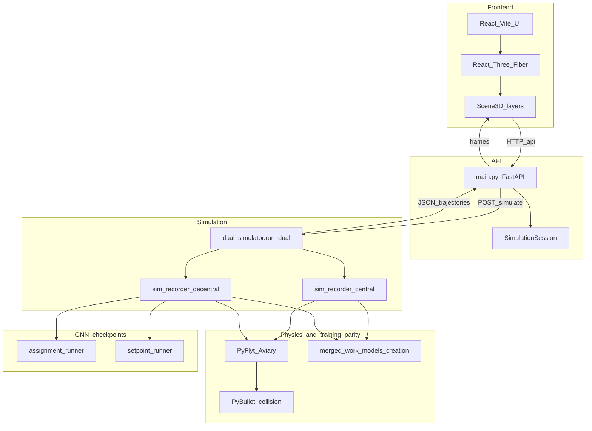
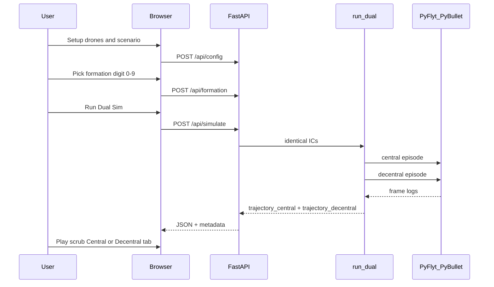
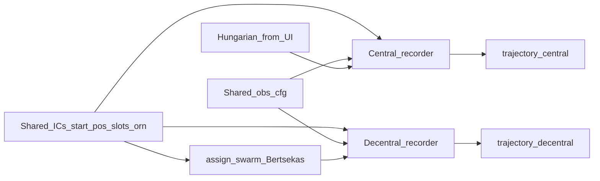
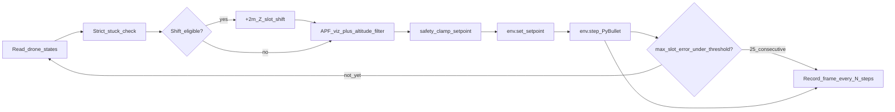
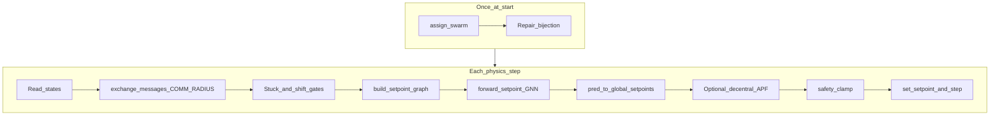
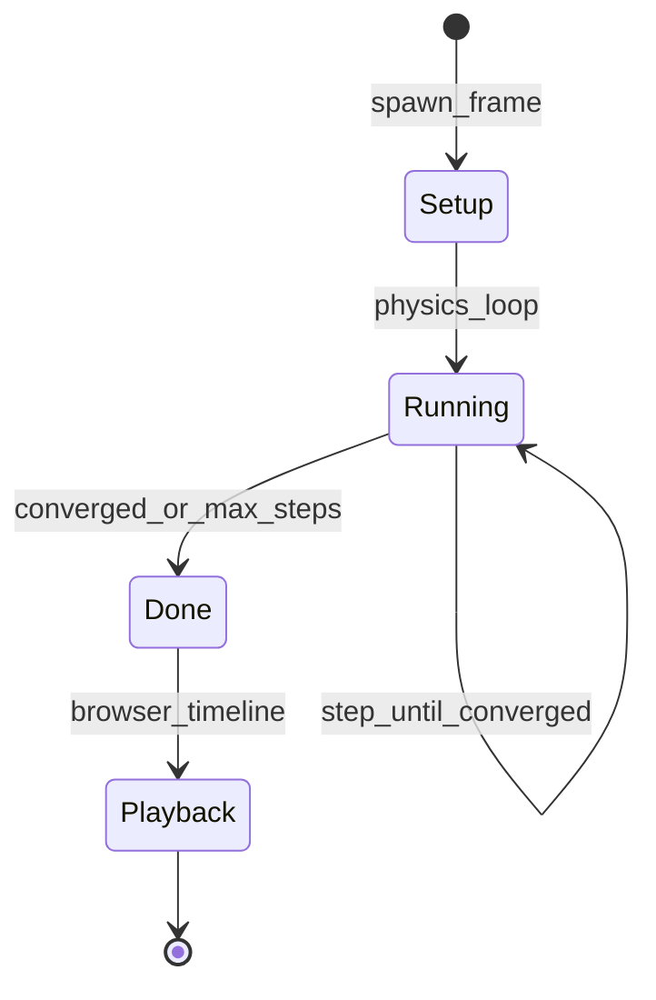
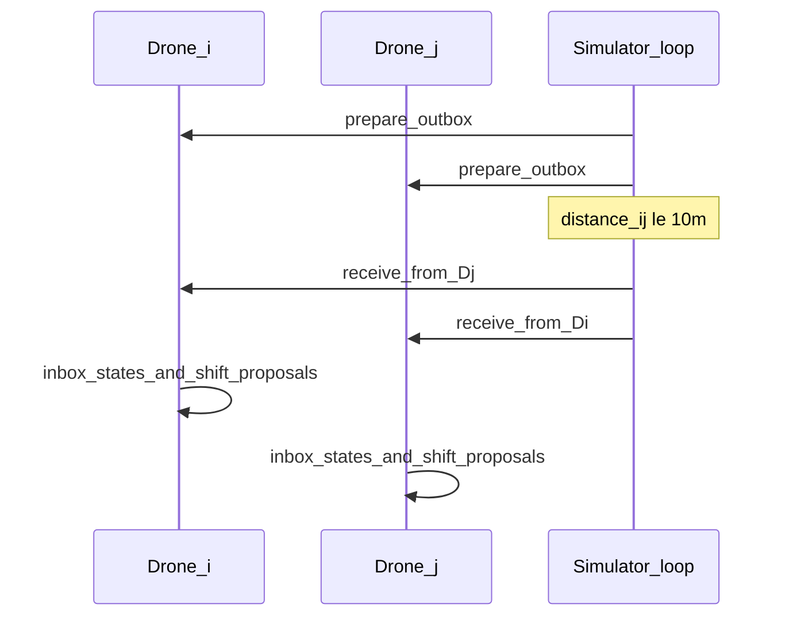
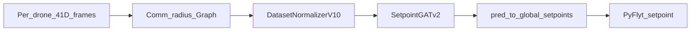
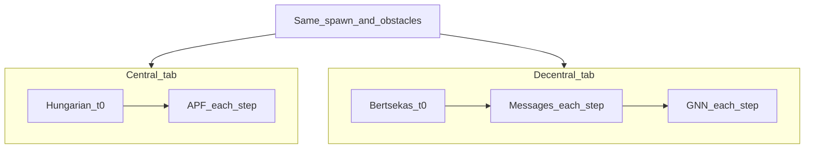

# Theoretical Swarm Visualization — Architecture Presentation

Browser-based **theoretical swarm lab** that runs two physics episodes on the **same spawn, digit formation, and obstacles**, then compares **Central** (classical control) vs **Decentral (GNN)** in 3D playback.

- Same initial poses and slot layout; different **assignment** and **control** policies.
- Headless simulation on the backend; the browser only **replays** recorded frames.
- For setup and config knobs, see [README.md](README.md).

---

## 1. System architecture

The app splits into four layers: React UI, FastAPI session API, dual recorders, and a single PyFlyt/PyBullet world shared with training code in `merged_work`.

| Layer | Role | Key paths |
|-------|------|-----------|
| Frontend | Setup, dual run, timeline, Central/Decentral tabs | `frontend/src/` |
| API | Session state, simulate, save/load runs | `backend/main.py`, `session.py` |
| Simulation | Record frame streams | `dual_simulator.py`, `sim_recorder_*.py` |
| Physics | 240 Hz integration, 1 m obstacle spheres | PyFlyt + PyBullet |
| Training parity | Obstacles, APF teacher, drone frames | `merged_work/models_creation/` |

---

## 2. User workflow

Optional: **Save run** / **Load** persists trajectories under `backend/saved_simulations/` without re-simulating.

---

## 3. Dual simulation entry

`run_dual` in [`backend/dual_simulator.py`](backend/dual_simulator.py) fixes one random seed episode, then runs two recorders.

| Input | Central | Decentral |
|-------|---------|-----------|
| Assignment | Hungarian from UI (`session.apply_formation`) | `assign_swarm` — Bertsekas + local negotiator GNN |
| Obstacles | Same `obs_cfg` built from central assignment | Same `obs_cfg` (fair comparison) |
| Physics cap | `MAX_STEPS_CONVERGED` when `RUN_UNTIL_CONVERGED` | Same |

---

## 4. Central simulation pipeline

**No neural networks.** Assignment is global at t=0; each step uses slot setpoints, sensor-gated APF, and a safety clamp before PyFlyt integrates.

**Convergence:** all drones within **0.35 m** (3D) of their **assigned slot** for **25** consecutive steps (`max_assigned_slot_error` in `sim_frame_utils.py`).

---

## 5. Decentral simulation pipeline

Decentral adds **comm-radius messaging**, **Bertsekas assignment** (once), and a **setpoint GATv2** forward each control step, then optional APF and clamp.

Hybrid control blends GNN prediction with pull toward assigned slots (`SETPOINT_PRED_GAIN` / `SETPOINT_GOAL_GAIN` in `viz_sim_config.py`). Learned shift head is optional (`ENABLE_HYBRID_SLOT_SHIFT`); goal-repair Z-shift uses the same strict stuck gates as Central.

---

## 6. How drones talk — and what is faithful

Messages are **StateMsg** (pose, velocity, alert, stuck) and **ShiftProposal** when locally stuck. Delivery is symmetric: drone *i* receives from *j* only if ‖pos_i − pos_j‖ ≤ **10 m** (`COMM_RADIUS`).

### Faithful vs orchestrated

| Aspect | Faithful to decentral design | Orchestrated in this demo |
|--------|---------------------------|---------------------------|
| Who can message whom | Only pairs within `COMM_RADIUS` | Simulator knows all positions to test range |
| GNN graph edges | Built from comm-radius pairs | One batched forward over full swarm |
| Assignment slots visible | `SLOT_VISIBILITY_RADIUS` (10 m) | Single `assign_swarm` call returns global map |
| Physics | PyFlyt setpoints per drone | **One** shared PyBullet world, not N processes |
| UI comm mesh | Purple links when distance ≤ 10 m | `CommLinksLayer.tsx` |

**Takeaway:** algorithms respect **local visibility and comm range**; the **implementation** is a centralized Python loop that simulates radio delivery and runs leader-style GNN inference — not independent drones on separate machines.

---

## 7. PyBullet and PyFlyt — supervisor and monitor

| Component | Role |
|-----------|------|
| **PyFlyt** | High-level quad API: spawn `quadx` drones, position-mode setpoints (`env.set_mode(7)`), `env.step()` |
| **PyBullet** | Underlying rigid-body engine: integration, **1 m** sphere obstacles (`spawn_spheres`), collisions |
| **Backend loop** | **Supervisor:** writes setpoints each step from APF/GNN logic |
| **Backend loop** | **Monitor:** reads position, euler, body/world velocity; logs alerts from planar lidar |
| **Frontend** | **Playback only** — no physics during scrub; `trajectory.dt` = physics_dt × `RECORD_EVERY` |

Simulation runs **headless** (`render=False`). The 3D view shows **recorded** poses; obstacle spheres are drawn at **half** visual scale (`OBSTACLE_MESH_VIS_SCALE = 0.5`) while collision radius stays **1.0 m**.

---

## 8. Model inference

Checkpoints live in [`resources/checkpoints/`](resources/checkpoints/) (four files required for simulate).

| Model | Files | When | Output |
|-------|-------|------|--------|
| Local negotiator + Bertsekas | `strict_local_negotiator_best_v1.pt`, `bertsekas_best_digits.pt` | Once per decentral run | `assignment[i]` → slot index |
| Setpoint GATv2 | `best_gatv2_digits.pth`, `normalization_stats_digits.pt` | Each control step (`SETPOINT_CTRL_EVERY = 1`) | Normalized 4D pred + shift logit → `pred_to_global_setpoints` |

The setpoint GNN is trained to imitate **APF teacher** displacements using **16-ray planar lidar** and graph features from `merged_work`. At runtime, the Website may still apply an optional APF prior and `safety_clamp_setpoint` (`ENABLE_DECENTRAL_APF`).

---

## 9. Central vs Decentral — at a glance

| | **Central** | **Decentral (GNN)** |
|---|-------------|---------------------|
| Assignment | Hungarian (`scipy.linear_sum_assignment`) | Bertsekas + learned negotiator |
| Control | Fixed slot targets + APF | GNN + goal blend + optional APF |
| Communication | None (implicit global plan) | `StateMsg` / `ShiftProposal` in 10 m |
| Slot shift | Strict stuck → +2 m Z (once) | Same + optional learned shift gate |
| Convergence metric | Assigned slot error &lt; 0.35 m | Same |

---

## 10. Technology stack

**Backend**

- FastAPI, Uvicorn — HTTP API
- Pydantic — request bodies
- NumPy, SciPy — geometry, Hungarian assignment
- PyTorch, PyTorch Geometric — GNN inference
- PyBullet, PyFlyt — physics
- Shared training code — `merged_work/models_creation`

**Frontend**

- React 18, TypeScript, Vite
- Three.js, `@react-three/fiber`, `@react-three/drei`
- Crazyflie GLB — `frontend/public/models/crazyflie.glb`

---

## 11. Key files map

| Topic | Path |
|-------|------|
| API entry | `backend/main.py` |
| Dual run | `backend/dual_simulator.py` |
| Central recorder | `backend/sim_recorder_central.py` |
| Decentral recorder | `backend/sim_recorder_decentral.py` |
| Messaging | `backend/agents/comm_orchestrator.py`, `drone_agent.py` |
| Setpoint GNN | `backend/website_gnn/setpoint_runner.py` |
| Assignment GNN | `backend/website_gnn/assignment_runner.py` |
| Viz knobs | `backend/viz_sim_config.py` |
| 3D scene | `frontend/src/components/Scene3D.tsx` |
| Session | `backend/session.py` |

---

## 12. Notes for presenters

- **Converged** in the UI means every drone stayed within **0.35 m** of its **assigned slot ring** for 25 physics steps — not merely that playback ended.
- Top-bar metadata may show `max_steps` with **slot error** (e.g. `err 4.20m`) when the cap is hit before convergence.
- **Decentral** is a *centralized simulator executing decentralized algorithms* — ideal for theory and comparison, not a deployed multi-agent network.

---

*Generated for the Website/Theoritical app. Operational details: [README.md](README.md).*
