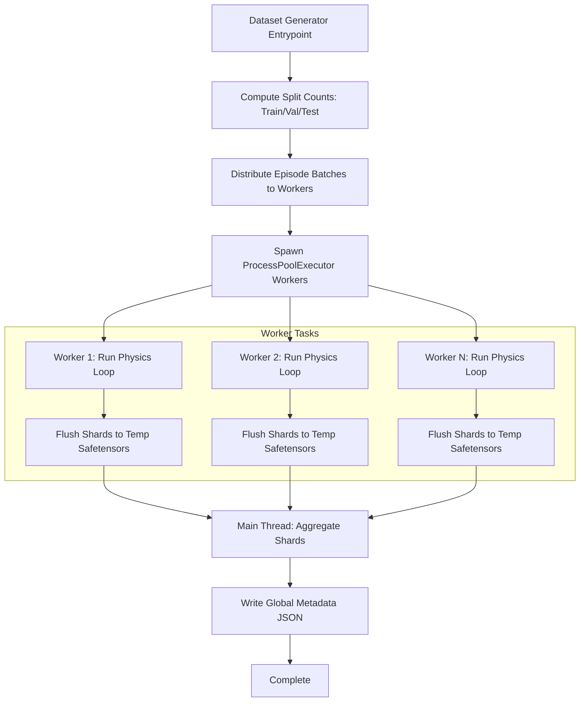

# Dataset Generator: Architecture, Concepts, and Benchmarking Report

## 1. Introduction

Unmanned Aerial Vehicle (UAV) swarms represent a transformative leap in autonomous robotics, enabling robust, scalable, and distributed solutions for complex missions such as search and rescue, structural inspection, and dynamic coverage. However, controlling dozens of fast-moving, physically interacting drones in cluttered environments is a mathematically intractable problem for traditional centralized controllers.

To bridge this gap, we turn to **Imitation Learning (IL)** using Graph Neural Networks (GNNs). IL requires vast amounts of expert-demonstrated flight data—mapping sensory observations to optimal control actions. Generating this data using real hardware is prohibitively expensive, dangerous, and time-consuming. 

**Objectives of this Data Collection:**
The primary objective of this dataset generator is to provide a highly scalable, physically accurate, and diverse simulation engine. It is designed to autonomously generate millions of expert multi-drone flight transitions. The generated datasets will train robust GNN policies capable of distributed formation control, real-time collision avoidance, and dynamic topology morphing without centralized oversight.

---

## 2. Related Work

Existing simulators for UAVs generally fall into two categories:
1. **High-Fidelity Visual Simulators** (e.g., Microsoft AirSim, NVIDIA Isaac Sim): These offer incredible photorealism and GPU-accelerated physics but are computationally heavy, making massive parallel data generation difficult on standard CPU nodes.
2. **Lightweight Physics Emulators** (e.g., Flightmare, PyFlyt): These strip away the rendering overhead to focus entirely on rigid-body dynamics and control loops.

Our framework is built on **PyFlyt** (backed by PyBullet) because it strikes the perfect balance for Imitation Learning: it enables headless, multi-core CPU parallelization while retaining accurate aerodynamic physics. Unlike standard datasets that provide static topologies, our generator actively simulates dynamic shape-shifting, sensor noise, and wind disturbances.

---

## 3. System Architecture

The dataset generator is architected for high-throughput, memory-safe parallel execution. Due to the Python Global Interpreter Lock (GIL), physics simulations cannot be effectively multi-threaded. Therefore, our system architecture relies on a **ProcessPoolExecutor** multiprocessing strategy.



### Amortizing Multiprocessing Overhead
Spawning Python worker processes introduces static overhead (importing heavy packages like `torch` and PyBullet, establishing IPC channels). For small datasets, this overhead dominates. However, for large-scale generations (100+ episodes), the physics computation time far outweighs the spawning cost, allowing the architecture to achieve near-linear multi-core scaling.

*Snippet from `dataset_generator/parallel.py` (Orchestrating concurrent simulation chunks):*
```python
# dataset_generator/parallel.py -> generate_dataset_parallel()
print(f"Launching {len(worker_tasks)} worker tasks across {num_workers} parallel processes...")
with ProcessPoolExecutor(max_workers=num_workers) as executor:
    # Submit chunked simulation tasks to separate independent python processes
    futures = {executor.submit(simulate_worker_chunk, task): task for task in worker_tasks}
    # ... progress tracking and Safetensor aggregation ...
```

---

## 4. Simulator Design

The core physics loop is executed by the `run_physics_episode` function (in `simulation.py`). This function initializes the PyFlyt `Aviary` and steps through time, generating expert trajectories.

### A. Environment Parameters and Disturbances
To ensure the IL agent learns robust policies (Domain Randomization), we inject various environmental disturbances such as physical wind and spherical obstacles. Crucially, we inject **Sensor Noise** to mimic real-world hardware (e.g., IMU drift, GPS inaccuracies).

*Snippet from `dataset_generator/features.py` (Domain randomization via Gaussian perturbation):*
```python
# dataset_generator/features.py -> maybe_add_sensor_noise()
def maybe_add_sensor_noise(global_pos, global_euler, local_lin_vel, local_ang_vel, noisy_sensors, noise_variance):
    if not noisy_sensors: return global_pos, global_euler, local_lin_vel, local_ang_vel
    # Inject zero-mean Gaussian noise (N(0, sigma^2)) into spatial state arrays
    global_pos = global_pos + np.random.normal(0, noise_variance, size=3)
    global_euler = global_euler + np.random.normal(0, noise_variance, size=3)
    local_lin_vel = local_lin_vel + np.random.normal(0, noise_variance, size=3)
    local_ang_vel = local_ang_vel + np.random.normal(0, noise_variance, size=3)
    return global_pos, global_euler, local_lin_vel, local_ang_vel
```

### B. Physics vs. Control Frequency
Quadcopters are governed by highly non-linear, high-speed aerodynamic rotor forces. Simulating these ODEs requires small time steps. However, flight control units (FCUs) receive high-level waypoint commands at much lower frequencies.

*Snippet from `dataset_generator/environment.py` (Decoupling control and physics integrations):*
```python
# dataset_generator/environment.py -> create_aviary()
drone_options = dict()
drone_options["control_hz"] = 60 # Match physical FCU target command latencies
# Step physics engine at 240 Hz to maintain rigid-body integration stability
env = Aviary(start_pos=start_pos, start_orn=start_orn, drone_type="quadx", 
             render=graphical, physics_hz=240, drone_options=drone_options)
```

### C. 3D Artificial Potential Field (APF)
To generate the "expert" ground truth for trajectory navigation, we calculate safe, collision-free intermediate setpoints dynamically. The virtual force $\mathbf{F}_{total}$ is the sum of attractive target forces and repulsive obstacle forces, which are then dynamically bounded to prevent physical impossibilities.

*Snippet from `dataset_generator/environment.py` (APF velocity bounds):*
```python
# dataset_generator/environment.py -> compute_apf_setpoints()
# 1. Calculate attractive vectors with horizontal/vertical specific gains
attractive = final_target_positions - current_positions
attractive[:, :2] *= attractive_gain
attractive[:, 2] *= vertical_gain

# ... [Calculate Repulsive Forces based on radial distance inside boundaries] ...

# 2. Velocity Bounding: Ensure delta movement doesn't exceed maximum kinematic capabilities
total_delta = np.copy(attractive)
total_delta[:, :3] += repulsive_xyz
norm = np.linalg.norm(total_delta, axis=1, keepdims=True)
scale = np.minimum(1.0, max_step_size / (norm + 1e-6))
bounded_delta = total_delta * scale

# 3. Yield the safe intermediate step
intermediate_positions = current_positions + bounded_delta
```

### D. Node and Edge Features (Addressing State Aliasing)
If we used absolute $x, y, z$ global coordinates, the GNN would memorize specific map locations and fail to generalize—a phenomenon known as **State Aliasing**. We eliminate this by decoupling global states into body-centric local representations and providing LiDAR-style spatial footprints.

*Snippet from `dataset_generator/features.py` (Decoupling representations to enforce translation/rotation invariance):*
```python
# dataset_generator/features.py -> build_drone_features()
# Extract purely local kinematics and sensory inputs
gnn_input_state = np.concatenate([local_lin_vel, local_ang_vel, obs_features])

# Convert global absolute error into the drone's local coordinate system using its rotation matrix
global_pos_error = target_global_pos - global_pos
local_pos_error = rot_matrix.T @ global_pos_error
yaw_error = target_global_yaw - global_euler[2]

# The neural network predicts this local correction vector
y_label = np.concatenate([local_pos_error, [yaw_error]])
```

### E. Tapered Sampling & Convergence Stopping
* **Convergence Stopping**: If all drones remain within a `conv_threshold` (e.g., 0.2m) of their target for >50 steps, the episode terminates early to save computational overhead and avoid flooding the dataset with static data.
* **Tapered Sampling (Temporal Curriculum Sculpting)**: Dynamic stride sampling provides an enormous advantage over static sampling by offering immense flexibility in dataset generation for machine learning. 
  * If the goal is **better convergence policies**, we increase sampling density at the beginning of the episode. This captures large state-error derivatives (high-dynamic transients) when the drones initially surge toward target formations.
  * If the goal is **better steady-state stability**, we can increase sampling towards the end of the episode to enrich the dataset with fine-grained micro-adjustments needed to reject hovering disturbances.

*Snippet from `dataset_generator/utils.py` (Evaluating sampling strides):*
```python
# dataset_generator/utils.py -> should_sample_step()
def should_sample_step(step_idx, max_steps, tapered_sampling, dense_sampling_steps, mid_sampling_steps, mid_step_stride, late_step_stride):
    if not tapered_sampling: return True
    # E.g., Stride=1 during high-transient initial takeoff
    if step_idx < dense_sampling_steps:
        return True
    # Tapering off stride length as agents settle into steady-state
    if step_idx < mid_sampling_steps:
        return step_idx % mid_step_stride == 0
    return step_idx % late_step_stride == 0
```

---

## 4.1 Dataset Topologies by Task Type

Different learning tasks require specific graph structures. The table below outlines how generated node features ($X$), edge features ($E$), and targets ($Y$) adapt:

| Task Type | Node Features (`x`) | Edge Features (`edge_attr`) | Prediction Label (`y`) |
| :--- | :--- | :--- | :--- |
| `setpoint_prediction` | `[local_lin_vel(3), local_ang_vel(3), lidar_rays(R), formation_hot(F)]` | `[rel_pos(3), dist(1), rel_vel(3)]` | Local position error `[x,y,z]` and local yaw error `[yaw]` |
| `residual_correction` | Same as above | Same as above | Global 3D residual displacement offset |
| `formation_assignment`| Same as above | Same as above | Target slot assignment index (Integer classification) |

---

## 5. Dataset Generation Methodology

A major bottleneck in generating large-scale multi-processing datasets is Memory Management.

### Safetensors vs. PyTorch (`.pt`)
Standard PyTorch datasets use Python's `pickle` module (`.pt` files).
* **RAM Overhead**: When multiple parallel workers read or write `.pt` files, Python loads the entire object tree into RAM. For large graphs, this rapidly triggers Out-Of-Memory (OOM) kernel crashes.
* **Safetensors Implementation**: Our `utils.py` bypasses this by serializing graph dictionaries directly into Hugging Face **Safetensors**.
* **Benefits**: Safetensors use zero-copy memory mapping (`mmap`). When workers load shards, they reference the data directly from the disk address space without duplicating it in RAM. It is also significantly faster to deserialize and fundamentally secure against arbitrary code execution (unlike `pickle`).

---

## 6. Experimental Evaluation

To evaluate our architecture, we developed an automated benchmarking suite (`test_parallelization.py`). This script executes the `setpoint_prediction` generation across a matrix of episode counts and episode lengths, plotting the results via Plotly.

**Parallelization Efficiency:**
Our experiments confirm the amortized overhead theory. 
* For short bursts (5 episodes, 100 steps), the speedup of a 4-core run vs. a serial run is only roughly $1.8\text{x}$.
* As the workload increases to **40 episodes at 400 steps**, the parallel execution achieves a speedup of roughly **$3.6\text{x}$ to $3.8\text{x}$ on a 4-core machine**, representing **>90% parallel efficiency**. 
The generated Plotly graphs highlight how the blue execution-time bars for parallel processes remain dramatically flatter than the exponential serial execution curve.

---

## 7. Limitations

While the current simulator is highly effective for Imitation Learning, it has notable limitations:

1. **PyBullet Physics Engine Bottlenecks**: PyBullet relies heavily on single-thread CPU calculations for physics steps (unlike NVIDIA Isaac Sim/Brax which compute tensor-based physics natively on GPUs). Additionally, its Linear Complementarity Problem (LCP) contact solver can occasionally result in inter-penetration during extreme high-velocity collisions.
2. **Simplified Aerodynamics**: The physics emulator abstracts away complex fluid dynamics like ground effect, rotor wash, and inter-drone aerodynamic interference, which heavily affect real drones flying closely in tight formations.
3. **Emulated Sensors vs. Real Hardware**: The LiDAR data is emulated using clean, idealized analytical or PyBullet ray-casting. Real drones utilize hardware like Ouster or Velodyne LiDARs, which exhibit distinct point-cloud sparsity patterns, reflection drop-outs, and hardware delays that our current simulation does not natively replicate without extensive custom noise wrappers.

---

## 8. Future Work

The immediate future work focuses on **Reinforcement Learning (RL) Integration**. 
Currently, the dataset generator produces offline, static datasets for Imitation Learning. The next architectural evolution involves wrapping the PyFlyt environment in a standard Gymnasium-compliant RL interface. 
By doing so, the generated IL dataset can be used to "warm-start" a GNN policy (Behavioral Cloning). Once the policy reaches a baseline proficiency, it can be seamlessly plugged into an online RL framework (like PPO or SAC) within this exact same simulator to explore, optimize, and fine-tune its collision-avoidance behavior dynamically.

---

## 9. Conclusion

The Dataset Generator developed for this project provides a scalable, safe, and highly efficient solution to the multi-drone data problem. By combining 240 Hz rigid-body aerodynamics with 3D Artificial Potential Fields, it reliably generates expert obstacle-avoidance trajectories. Furthermore, through careful engineering—including translation-invariant feature design, tapered sampling, and Safetensors-backed multi-core parallelization—the framework ensures that the resulting datasets are balanced, memory-efficient, and perfectly tailored to train state-of-the-art Graph Neural Networks.
