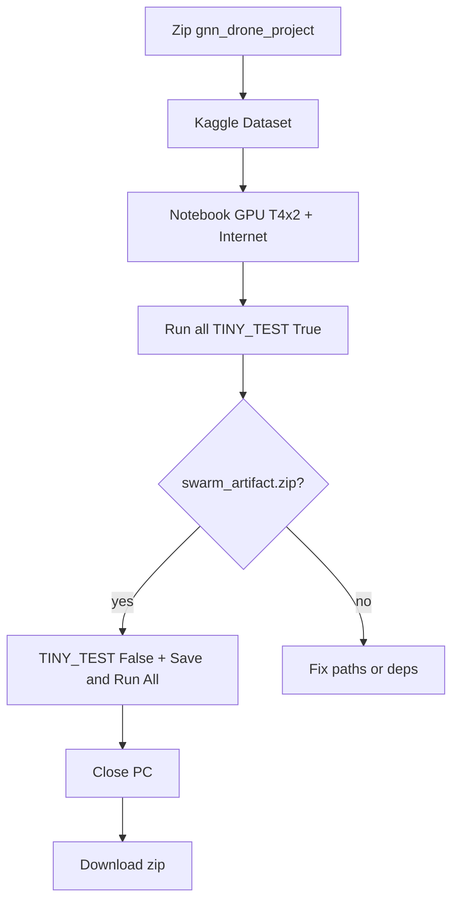

# Kaggle runbook — digit formations pipeline

Follow these steps end-to-end. The notebook [`models_creation/finals.ipynb`](models_creation/finals.ipynb) defaults to **`CUDA_VISIBLE_DEVICES=0`** (one logical GPU; avoids PyTorch `DataParallel` + PyG crashes on 2×T4), **`RUN_GPU_SMOKE = True`**, and **`TINY_TEST = True`** so the first **Run all** is a real end-to-end smoke (incl. ~2-epoch setpoint training) in ~10–25 minutes.

---

## Step 1 — Package the repo (on your PC)

1. Zip the entire **`gnn_drone_project/`** folder (right-click → Send to compressed folder).
2. Name it `gnn_drone_project.zip`.
3. Unzip once locally and confirm the path exists:
   `gnn_drone_project/merged_work/models_creation/finals.ipynb`

---

## Step 2 — Create a Kaggle Dataset

1. Go to [kaggle.com](https://www.kaggle.com/) and sign in.
2. **Datasets** → **+ New Dataset**.
3. Upload `gnn_drone_project.zip`. Wait until processing finishes.
4. Title: e.g. `drone-swarm-merged`. Visibility: **Private**.
5. Click **Create**. Note your slug: `your-username/drone-swarm-merged`.

---

## Step 3 — Create the notebook

1. **Code** → **+ New Notebook**.
2. Right sidebar:
   - **Accelerator** → **GPU T4 x2**
   - **Internet** → **On** (required for pip)
3. **+ Add Input** → search your dataset → **Add**.
4. Optional sanity check (new cell): `!ls /kaggle/input/` — you should see your dataset folder, and inside it `gnn_drone_project/merged_work/...`.

---

## Step 4 — Load finals.ipynb

1. **File** → **Upload notebook** → select  
   `gnn_drone_project/merged_work/models_creation/finals.ipynb` from your PC.
2. Or copy cells manually from the local notebook.

---

## Step 5 — Warm-up / dry-run (~10–25 minutes)

1. Leave **`RUN_GPU_SMOKE = True`** and **`TINY_TEST = True`** (defaults).
2. **Run** → **Run all**.
3. Expected prints:
   - `CUDA_VISIBLE_DEVICES=0 (single GPU...)`
   - `REPO: /kaggle/input/.../gnn_drone_project`
   - `WORK: /kaggle/working/merged_artifacts`
   - `>>> GPU SMOKE PASSED` (if PyFlyt is OK) — proves setpoint GNN training works on this kernel
   - `PyFlyt OK` **or** `[skip] GPU smoke — PyFlyt unavailable`
4. The §5 pipeline cell should end with:
   `Done in X.X min. Artifact: /kaggle/working/merged_artifacts/swarm_artifact.zip`
5. Right sidebar → **Output** → confirm **`swarm_artifact.zip`** exists.

If cell 1 fails with `merged_work not found`, your dataset layout is wrong — re-zip so the top folder inside the zip is `gnn_drone_project/`.

---

## Step 6 — Full overnight run

1. Open the configuration cell. Set **`RUN_GPU_SMOKE = False`** (saves time) and **`TINY_TEST = False`**. Save (Ctrl+S).
2. If you previously generated a different setpoint dataset in `/kaggle/working/merged_artifacts`, delete the stale `setpoint_digits_*.pt` files (or clear the working dir) so episode counts / scenario mix are not skipped by the resumable saver.
2. Top right → **Save Version**.
3. Choose **Save & Run All (Commit)**.
4. **Advanced settings** → enable **Save output for this version**.
5. Click **Save**.
6. You may close the browser and shut down your PC. Kaggle runs on their servers (max **12 h**).

---

## Step 7 — Validate setpoint imitation (recommended)

After training finishes, in a notebook cell (same kernel, repo on path):

```python
from pathlib import Path
from merged_work.models_creation.validate_setpoint_imitation import run_validation

results = run_validation(Path("/kaggle/working/merged_artifacts/checkpoints"))
print(results)
assert results["all_ok"], "Setpoint validation gates failed — do not deploy to Website"
```

Check `results/setpoint_eval_metrics.json`: `"direction_weight": 0.0`, `"shift_weight": 0.0`.

---

## Step 8 — Download results (next morning)

1. **Your Work** → **Notebooks** → open your notebook.
2. Open the latest **Version** (status should be **Successful**).
3. **Output** tab → `merged_artifacts/swarm_artifact.zip` → download.

### Inside the zip

| Path | Contents |
|------|----------|
| `checkpoints/strict_local_negotiator_best_v1.pt` | LocalNegotiator pretrain (assignment base) |
| `checkpoints/bertsekas_best_digits.pt` | Bertsekas assignment GNN |
| `checkpoints/best_gatv2_digits.pth` | Setpoint GATv2 weights (if PyFlyt worked) |
| `checkpoints/normalization_stats_digits.pt` | Setpoint input normalizer |
| `negotiator_dataset_digits.pt` | Full assignment dataset list |
| `assignment_digits_{train,val,test}.pt` | Assignment splits |
| `setpoint_digits_{train,val,test}.pt` | Setpoint splits (if PyFlyt worked) |
| `pipeline_metadata.json` | Timing and config provenance |

---

## Step 9 — Copy checkpoints into the Website

Copy these from `merged_artifacts/checkpoints/` into  
`gnn_drone_project/Website/Theoritical/resources/checkpoints/`:

- `strict_local_negotiator_best_v1.pt`
- `bertsekas_best_digits.pt`
- `best_gatv2_digits.pth`
- `normalization_stats_digits.pt`

Activate your project venv, then run the backend (see `Website/Theoritical/README.md`).  
Decentral tab uses **learned displacements only** (no runtime APF).

---

## Step 10 — Resume after a failed run

Every stage skips if its output file already exists.

1. Open the failed notebook version → **Output** → **Use as input** on the partial output.
2. In a new notebook session, add at the top:
   ```python
   !cp -r /kaggle/input/<your-output-dataset>/merged_artifacts /kaggle/working/
   ```
3. **Save Version** → **Save & Run All** again. Only missing stages re-run.

---

## Troubleshooting

| Symptom | Fix |
|---------|-----|
| `merged_work not found` | Re-upload dataset; zip must contain `gnn_drone_project/merged_work/` |
| `torch_geometric` install fails | Use Kaggle image **Python 3.10 + GPU** with PyTorch; do not pip-install scatter/sparse |
| `PyFlyt unavailable` | Assignment models still train; try `!pip install "pyflyt>=0.20.0" --no-deps` then restart kernel |
| Many `setpoint FAILED` lines | Normal for a few episodes; if all fail, PyFlyt/PyBullet issue — check Output for assignment-only zip |
| Commit finished but tiny zip | You left `TINY_TEST = True` — re-commit with `TINY_TEST = False` |
| Drones fly through obstacles in Website | Old weights or stale `setpoint_digits_*.pt`; re-run with **current** `merged_work` code; confirm `direction_weight: 0` in metrics; copy fresh `.pth` + `.pt` normalizer |

### v2 imitation training (current `merged_work`)

Before overnight run, **delete** stale outputs in `/kaggle/working/merged_artifacts/`:

- `setpoint_digits_train.pt`, `setpoint_digits_val.pt`, `setpoint_digits_test.pt`
- `checkpoints/best_gatv2_digits.pth`, `checkpoints/normalization_stats_digits.pt`

Code changes in this zip:

- `direction_weight = 0`, obstacle-weighted MSE, **raw slot goals in frame features** (APF only in labels/controller)
- Z slot shift (+2 m) when strict stuck after step 20 (`SHIFT_MIN_STEPS`; independent of `CONV_STEPS=25`)
- Scenario mix 10% clean / 30% path / 30% slot / 30% both
- Production default `setpoint_episodes=500` in `finals_pipeline.py`

---

## Quick reference


